# Front-end-Class2

Front-end Crash course for Kadoos Private educational Institute. (HTML, CSS, and Bootstrap)

## Basics of the Web Applications

### Internet and Network Foundations

- Basics

  - Network History
  - All kinds of Applications
  - Web Applications
  - 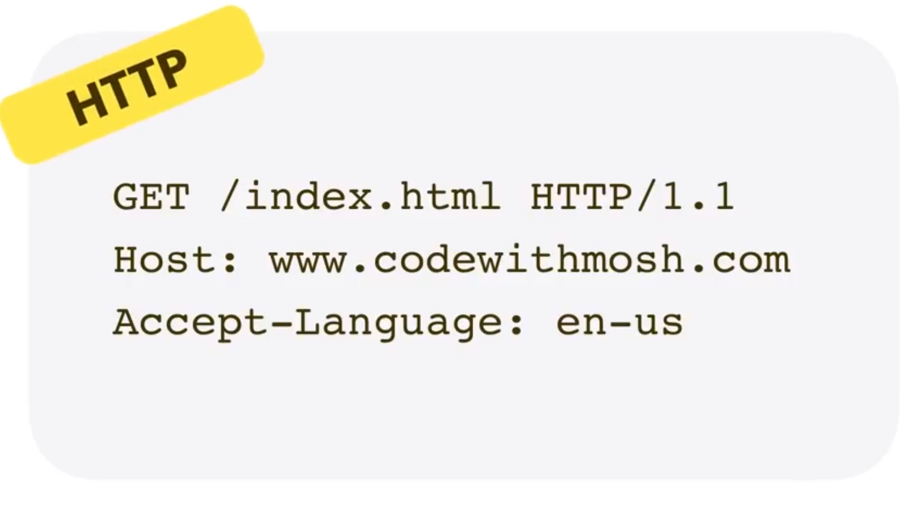

- Web Applications

  - Static
  - Dynamic

- Two Important aspects of Web Applications

  - Front-end
  - Back-end
  - Server and apps

- Front-end Basics

  - Blocks
  - Design
  - Functionalities

- Technologies

  - HTML (Hyper Text MarkUp Language)
  - CSS (Cascaded Style Sheet)
  - JavaScript

### HTML

- What is the HTML?

  - Browsers can Handel all things (inspect)
  - You can Work on A single text file
  - Talk about editors and IDEs
  - Talk about postfix and extensions
  - What creates a Html file
  - Talk about tags(Basics) angle brackets <>
  - Four Important basic Tags `<!Doctype html>`, `<HTML>`, `<Head>`, and `<Body>`
  - Markup elements
  - Heading tags
  - Paragraph tag
  - Line Break tag (Empty elements)
  - Line tag (self clos tag)
  - Comment Tag `<!-- -->`
  - &nbsp mark for space

- Lists

  - Unordered lists `<ul>`
  - Ordered lists `<ol>`
  - List items `<li>`

- Tables

  - Table tag `<table>`
  - Row tag `<tr>`
  - Data tag `<td>`
  - Column tag `<th>`

- Links

  - Link to outside tag `<a href="www.google.com">`Google`</a>`
  - Define Attributes `href`
  - Link to inside tag `<a href="#Birds">` and `<a name=Birds>`

- Images

  - Image tag ``
  - Source attribute
  - Size Attributes
  - Use optimize size for your images
  - Alt Attributes

- Nested Elements

  - `<html>` is root elements
  - Child elements
  - Parent elements
  - Mismatch Elements

- HTML Forms

  - To collect data to do something
  - Implement a textbox element/ control (`type="text"`)
  - Attributes are belong to CSS and JavaScript courses
  - Implement a label element
  - Add a Multi line textbox (textarea)
  - We can use just simple text as label
  - Implement a submit button (`type="submit"`)
  - Implement a Radio button (`type="radio"`)
  - Radio's name should be the same
  - Implement a CheckBox button (`type="checkbox"`)
  - Use `checked="checked"` for checked a box by default
  - Implement a Numbers field (`type="number"`)
  - For restrict user from entering random number we need JavaScript
  - Set `min=""` and `max=""` for your Numbers input
  - Implement a DropDownList using `select` tag
  - For Items we use `<option>` tag
  - Implement a date element `type="date"`
  - Use `<fieldset` tag to give a nice style to your page
  - `<legend>` tag add a nice title to your fieldset

- HTML Attributes

  - Differences between tags and elements
  - A specific attribute gives extra information about a the tag
  - Some attributes can be placed in every HTML elements tag
  - Like `class=""` attribute

- Meta Elements
  - Is always put inside `<head>` elements
  - These elements give more information to search engines about your page
  - Meta tags is self-content tags and don't need close tag
  - Description Meta tag uses only 155 character
  - Keywords used for demonstrate the content of page to some search engin (Except Google)
  - Meta tags also give extra information about Author or language
- Special Characters

  - There is scape characters in HTML5
  - 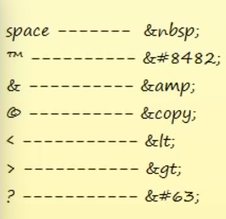

- Bold and Italic style

  - Use `<b>` tag to make a text bold
  - Use `<Strong>` tag to make a text bold
  - `<strong>` tag has special uses (ex: text speech programs) but ` <b>` tag is only for styling
  - Use `<i>` tag to make a text italic
  - Use `<em>` tag to make a text bold
  - `<em>` tag has special uses (ex: text speech programs) but ` <i>` tag is only for styling

- Iframe Element

  - Use this element to embed content of another page to your page (for adverts, navigation, or images)

- Super & Sub Script

  - Its about topography and placing text and symbols at the top or bottom of other text

- Title and Alternative

  - In HTML5 we can use title attribute in every elements to show information about them when mouse hover over them
  - `alt` attribute show information about absence of an element

- Audio Tag

  - To place an audio in your page ypu can use `<audio>` tag
  - It support three different format file (`.mp3, .wav, and .ogg`)
  - It's important that you should place a `control` attribute for your audio element but you can choose arbitrary name for it
  - For placing different format of a file we can use `<source>` tag
  - By `autoplay` attribute you can play your file automatically
  - By `loop` attribute you can play your file in infinite loop
  - By `draggable="true"` attribute you can drag your player everywhere

- Video Tag

  - To place an audio in your page ypu can use `<video>` tag
  - It support two different format file (`.mp4 and .ogg`)
  - For placing different format of a file we can use `<source>` tag

- DOCTYPE

  - It shows the version of HTML that we use in our document

- Document Object Model (DOM)

  - It's a model that present HTML elements i our document
  - 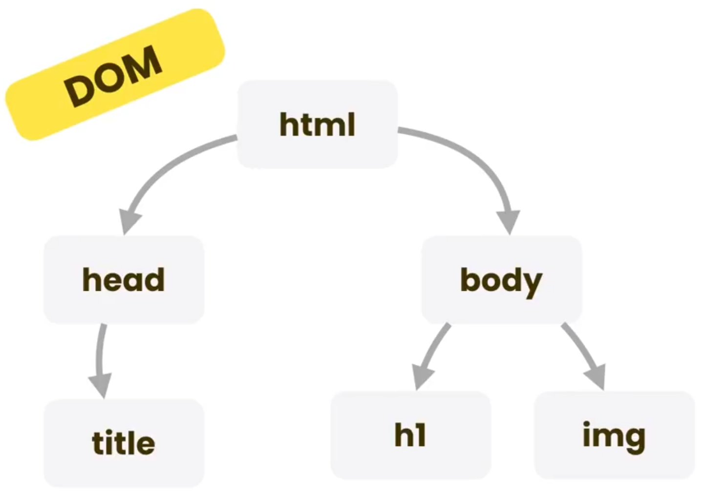
  - Use w3 validator to check your HTML codes
  - https://validator.w3.org/

- HTML Semantic Elements

  - A semantic element clearly describes its meaning to both the browser and the developer
  - A semantic Web allows data to be shared and reused across applications, enterprises, and communities
  - 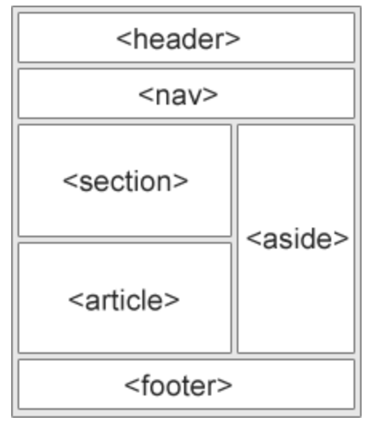
  - 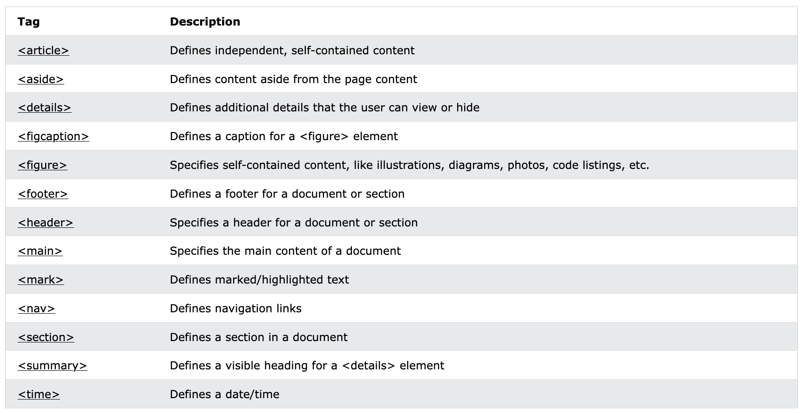

- Additional HTML Tags

  - Use `<pre>` tag for preformatted text
  - Use `<blockquote cite="">` tag for A section that is quoted from another source
  - Use `<code>` tag for code snippets
  - Use `<dl>` tag for present a description list (`<dt>`, `<dd>`)

- Exercise
  - Section1: 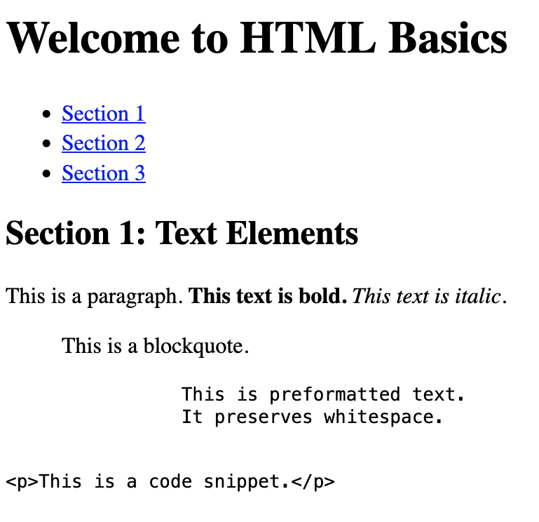
  - Section2: 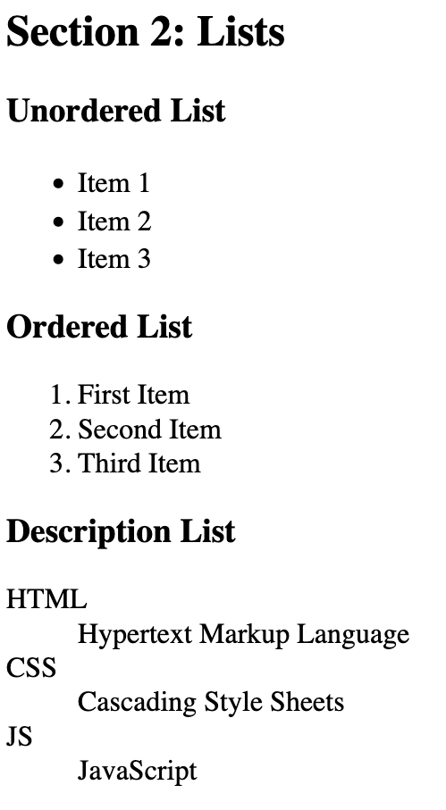
  - Section3: 

### CSS

- What is the HTML?

  - CSS is Cascading Style Sheet for describing look and formatting documents
  - Adds style to your HTML
  - Talk about another HTML tag: `<style>`
  - select a tag in your HTML document ex:`h1 {  ...  }`

- Changing font color, type, and size

  - Use `color`, `font-size`, and `font-family` property to change respectively color, size, and font type of your text

- Multi Selecting Tags

  - `h1, h2 {   ....  }`

- Border Property

  - `border-bottom`, `border-top` ...

- CSS Inheritance and Overriding

  - What you get with hierarchy is inheritance
  - 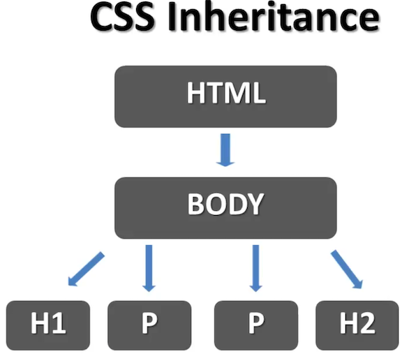
  - Child properties from their parents
  - To change something individually you should change that in the child tag using overriding rule

- Using Classes

  - Create two paragraph with different classes (`blue`, `red`) and define classes in style tag
  - It don't need it to put class attribute closing tag
  - By removing tag name before dot notation it can be apply on all tags which have a specific class attribute
  - You can use multiple class name in your class attribute
  - Apply it by using `text-decoration` property

- Font Family

  - You can define which font apply on your text
  - If none of those fonts don't exist in the client computer system default font apply on your text
  - It's better to put font family property in your `body` tag

- Font Weight Property

  - Use `normal`, `bold`, `bolder`, and `lighter` for check this property

- External Style Sheet

  - There is three way to apply stylesheet on HTML
  - `internal style sheet`, `external style sheet`, and `inline style sheet`
  - Internal stylesheet is good if you have only one page
  - It's more realistic to use external stylesheet
  - Create a separate file for your stylesheet `.css`
  - Transfer your code to your new file
  - Create a link tag in your head element
  - Define true address for your link

- Text Decoration

  - Talk about `line-through`, `underline`, and `overline` property (`none`)
  - Talk about italic style by `font-style` and creating three different paragraph and classes
  - To make a word italic it's better to use HTML tags

- Web Colors

  - There is three primary way to add colors
  - `use 16 primary colors`, `use RGB values`, and `use hex-codes`
  -
  - Primary colors
  - 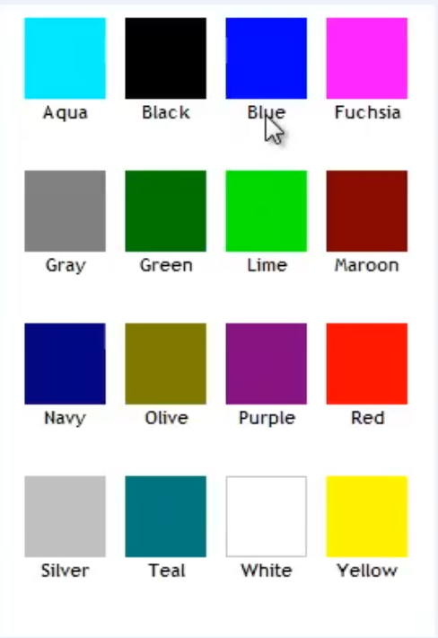
  -
  - RGB colors
  - 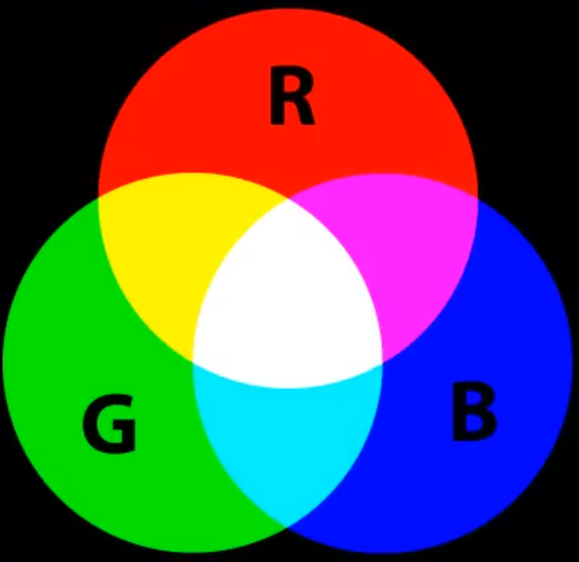
  - Check this colors in windows paint
  - Use `rgb(number for red, number for green, number for blue);` property
  - It's better to use hex-code color code. It's more professional
  - Use for ex: `#ff2456` format for apply color on your tags numbers in hex-code cover around 16 million different color `00..ff`

- Inline Style Sheet

  - Use `style` property inside a tag
  - Separate properties using `;`
  - Only use this way when you have a rock solid tag that never change

- More Font Size

  - Four way to apply size to texts `font-size:---`
  - `px`, `%`, `em`, and `keywords`
  - Define font size in `body` and use different `font-size` for `h1`, `h2`, and `p`
  - `px` define size based of number of pixels
  - `%` change font size based on inheritance and parent tag font size
  - This is a relative unit of measures
  - Calculate the new measure by calculator
  - `em` do the same thing that percentage is doing
  - By change the value in body you can change other tags without editing

- Line Hight Property

  - By using this property you can make your text more readable
  - `line-hight:...;`
  - Size rules are useable here

- CSS Box Model

  - 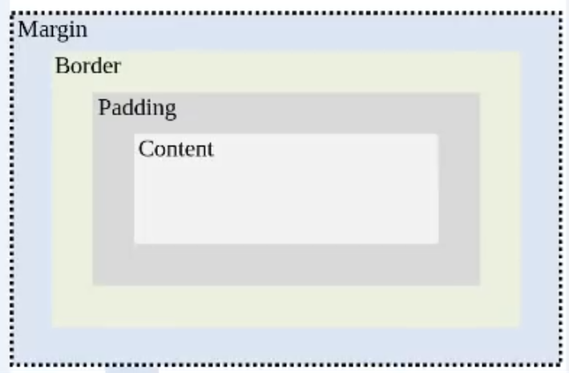
  - - Every elements in our HTML file have these boxes around them
  - `Content`: Everything goes there like our text
  - Show box using `background-color` property
  - Define a `border` in three line and than one line
  - `padding`: Is distance between content and border
  - browser add a default padding and margin to elements
  - `margin`: Is distance between border and other elements
  - Check `margin` changes between two paragraph
  - `padding-top`, `padding-bottom`, `padding-left`, and `padding-right`
  - `margin-top`, `margin-bottom`, `margin-left`, and `margin-right`
  - Even `body` tag is surrounded by Box model
  - Bay adding temporary border you can check box around a element
  - Use Image tag in page to demonstrate Box model around it using class attribute
  - HTML elements come in top-down order
  - By setting `margin-left` and `margin-right` to `auto` our element become centralized
  - Add border and background to our image
  - We can combine our property values in in line by four value (`top`-`right`-`bottom`-`left`)
  - Color of background applies on the padding
  - Set margin to 0 and check other elements margin
  - Set `body` tag margin to 0

- Background Image Property

  - Use google and download claud pattern css
  - `background-image:url(...);`
  - We can use `url` for the source of image
  - By using this property we can give background image to each tag that we want

- The ID Attribute

  - Use `ID` attribute when you want to apply an individual style to a specific tag
  - Use class attribute when you want to apply a style to a list of objects from same classes
  - `ID` attribute has higher priority than `class` attribute

- Text Align Property

  - `text-align:`center, right, left
  - Apply it on headers
  - It changes by the changing the page size

- Border Property

  - Explain border property and its individual elements
  - Talk about combination of all properties
  - Check values for all properties
  - Use `border-radius` to curve the border
  - This property doesn't work in some browsers
  - You can add curves to the selected corners
  - Check selected curves to by corner properties
  - You can also apply other border properties to specific sides

- &lt;Div&gt; Element

  - This element is used more and more in related to CSS
  - We `div` to define logical sections in our webpage
  - The `class` property can be placed in a tag or in a `div` tag which surrounded that tag
  - Notice to inheritance and `body` tag properties when you use `div` to separate your pages

- The &lt;SPAN&gt; Element

  - `SPAN` is similar to the `div` but operates on a small scale
  - It can work inside a individual element like paragraph
  - Explain it by using `highlight` class
  - Divs work like container but SPAN work inside other elements

- Reuse CSS

  - We can use only one CSS file for our all pages
  - We need to only link new file to our CSS stylesheet

- Special Effects

  - We use `pseudo classes` to add some special effects to our elements
  - Use `:` to define a pseudo class
  - It doesn't need to define anything in HTML file

- Positioning Elements

  - By execute positioning on CSS you can put your element in a arbitrary location
  - Elements are divided into two basic types: `Block` / `Inline`
  - Block element is major structural element and it extends all the way from the left to the right side of the page
  - Block element take all its share from left to right and it's a `natural flow`
  - By adding `width` to a block element it looses its share
  - By default All elements is in a block and there is a top-down priority for them
  - Block element share in page is true for nested elements
  - Images and spans are `Inline` elements
  - Inline elements only stretches by the size of content
  - By explain `Box model` on Block and Inline elements demonstrate the actual differences
  - Notice Images take margin property all around them but Span takes it only in the left and right side
  - Margin of two Inline elements are completely apply but between two block elements only one margin space take place
  - Always higher element's margin apply between two block element
  - We can convert a block to Inline and vice versa by using `Display` property
  - Talk about two block and Inline elements' margin and centralize them

- Floating an Element

  - By using floating element we can define a position for an element (define `width` and set float to `left`)
  - By define float property we actually interrupt natural flow and put some space for next item in the list
  - Use percentage (`50%`) to divide screen into two pieces

- Absolute Positioning for an Element

  - By using `position` property we can define and `absolute` and optional position for an element (Also `top`, `left`, `bottom`, and `right` properties are needed)
  - By using position property our element exits from flow completely and not respect to borders (decrease the top and left size)
  - Float property respects the boundaries

- Fixed Positioning for an Element

  - By switch the value of position property to `fixed` we can put an element in concrete position (use `TLBR`)
  - Try to not using it, because it bothers you web page users
  - Sometime it's used for advertisement
  - We talk about relative positioning in the future

- Overflow Property

  - By using `overflow` property we can define a showing option for content that is not fit to the hight of element
  - Use different options like: scroll, hidden, and the like

- The Cursor Property

  - You can change the mouse cursor icon over elements by define `cursor` property
  - Use different shape of cursers

- Custom Cursor

  - By using `Url` option for cursor we can add our icon to cursor collection and use it
  - Search in windows and use an `icon` to define it
  - Use default option for safety mechanism

- Text ans Images

  - When you want to alien an image within a text you can do it by adding the `float` property to its class
  - By default Image is in flow and by floating it all free space after it allocate to the next item (ex:text)
  - Adding margin to the class creates enough free space between them
  - Large margin for the bottom can create a nice style for text
  - By moving image tag to outside of the paragraph tag they can by aligned

- Relative Positioning

  - All elements are in the flow and have static position
  - Check `position: static;` for square and it doesn't move
  - Position options are `static`, `relative`, and `absolute`
  - For apply a relative option we should use two option of `TRBL`
  - `Relative` positioning look to the first static element at the side (top last paragraph / left edge of last div)
  - `Absolute` position look to the first Non-static element
  - Change position of the square to absolute to show differences (bottom-right) and change it for another element
  - Typically we don't use relative positioning for our main content panel
  - We use relative when we want to keep an absolute element in our content

- Vertical Menu

  - Start with a un ordered list and address tag for list items
  - First, we should change `list-style` to `none` to remove bullet points
  - Set padding and margin to `0`
  - Change `text-decoration` property to `none` for anchor tag and also `font-family`, `background-color`, and `color` property
  - `Anchor` tag is inline element
  - By changing display to `block` and set width to `80px` and margin to `5px` and margin to `10px` our menu get shape
  - We need another selector for special effects

- Horizontal Menu

  - Put your unordered list inside a section(div)
  - All the process is similar to vertical menu except setting the display to `inline` for `li`

- Beautiful Button
  - P
