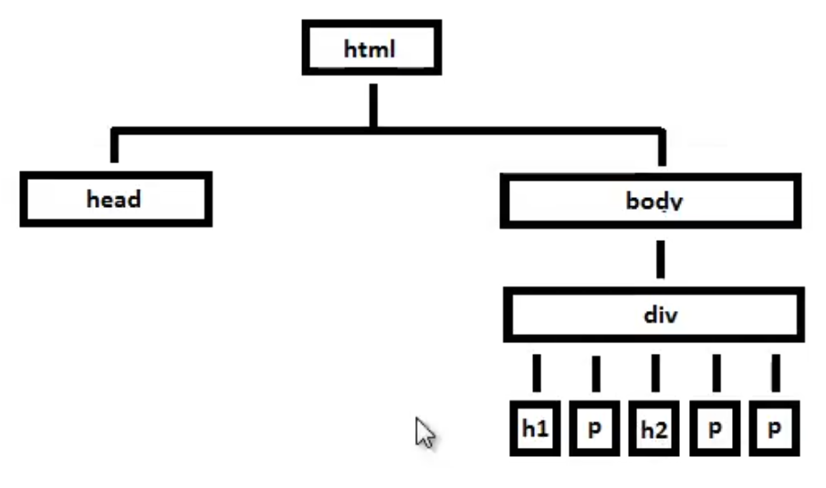
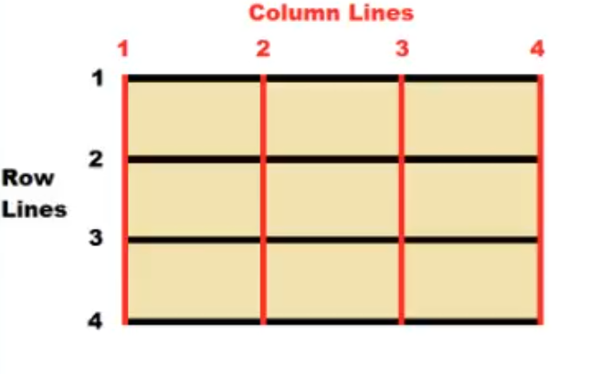

# Front-end-Class2

Front-end Crash course for Kadoos Private educational Institute. (HTML, CSS, and Bootstrap)

## Basics of the Web Applications

### Internet and Network Foundations

- Basics

  - Network History
  - All kinds of Applications
  - Web Applications
  - 

- Web Applications

  - Static
  - Dynamic

- Two Important aspects of Web Applications

  - Front-end
  - Back-end
  - Server and apps

- Front-end Basics

  - Blocks
  - Design
  - Functionalities

- Technologies

  - HTML (Hyper Text MarkUp Language)
  - CSS (Cascaded Style Sheet)
  - JavaScript

### HTML

- What is the HTML?

  - Browsers can Handel all things (inspect)
  - You can Work on A single text file
  - Talk about editors and IDEs
  - Talk about postfix and extensions
  - What creates a Html file
  - Talk about tags(Basics) angle brackets <>
  - Four Important basic Tags `<!Doctype html>`, `<HTML>`, `<Head>`, and `<Body>`
  - Markup elements
  - Heading tags
  - Paragraph tag
  - Line Break tag (Empty elements)
  - Line tag (self clos tag)
  - Comment Tag `<!-- -->`
  - &nbsp mark for space

- Lists

  - Unordered lists `<ul>`
  - Ordered lists `<ol>`
  - List items `<li>`

- Tables

  - Table tag `<table>`
  - Row tag `<tr>`
  - Data tag `<td>`
  - Column tag `<th>`

- Links

  - Link to outside tag `<a href="www.google.com">`Google`</a>`
  - Define Attributes `href`
  - Link to inside tag `<a href="#Birds">` and `<a name=Birds>`

- Images

  - Image tag ``
  - Source attribute
  - Size Attributes
  - Use optimize size for your images
  - Alt Attributes

- Nested Elements

  - `<html>` is root elements
  - Child elements
  - Parent elements
  - Mismatch Elements

- HTML Forms

  - To collect data to do something
  - Implement a textbox element/ control (`type="text"`)
  - Attributes are belong to CSS and JavaScript courses
  - Implement a label element
  - Add a Multi line textbox (textarea)
  - We can use just simple text as label
  - Implement a submit button (`type="submit"`)
  - Implement a Radio button (`type="radio"`)
  - Radio's name should be the same
  - Implement a CheckBox button (`type="checkbox"`)
  - Use `checked="checked"` for checked a box by default
  - Implement a Numbers field (`type="number"`)
  - For restrict user from entering random number we need JavaScript
  - Set `min=""` and `max=""` for your Numbers input
  - Implement a DropDownList using `select` tag
  - For Items we use `<option>` tag
  - Implement a date element `type="date"`
  - Use `<fieldset` tag to give a nice style to your page
  - `<legend>` tag add a nice title to your fieldset

- HTML Attributes

  - Differences between tags and elements
  - A specific attribute gives extra information about a the tag
  - Some attributes can be placed in every HTML elements tag
  - Like `class=""` attribute

- Meta Elements
  - Is always put inside `<head>` elements
  - These elements give more information to search engines about your page
  - Meta tags is self-content tags and don't need close tag
  - Description Meta tag uses only 155 character
  - Keywords used for demonstrate the content of page to some search engin (Except Google)
  - Meta tags also give extra information about Author or language
- Special Characters

  - There is scape characters in HTML5
  - 

- Bold and Italic style

  - Use `<b>` tag to make a text bold
  - Use `<Strong>` tag to make a text bold
  - `<strong>` tag has special uses (ex: text speech programs) but ` <b>` tag is only for styling
  - Use `<i>` tag to make a text italic
  - Use `<em>` tag to make a text bold
  - `<em>` tag has special uses (ex: text speech programs) but ` <i>` tag is only for styling

- Iframe Element

  - Use this element to embed content of another page to your page (for adverts, navigation, or images)

- Super & Sub Script

  - Its about topography and placing text and symbols at the top or bottom of other text

- Title and Alternative

  - In HTML5 we can use title attribute in every elements to show information about them when mouse hover over them
  - `alt` attribute show information about absence of an element

- Audio Tag

  - To place an audio in your page ypu can use `<audio>` tag
  - It support three different format file (`.mp3, .wav, and .ogg`)
  - It's important that you should place a `control` attribute for your audio element but you can choose arbitrary name for it
  - For placing different format of a file we can use `<source>` tag
  - By `autoplay` attribute you can play your file automatically
  - By `loop` attribute you can play your file in infinite loop
  - By `draggable="true"` attribute you can drag your player everywhere

- Video Tag

  - To place an audio in your page ypu can use `<video>` tag
  - It support two different format file (`.mp4 and .ogg`)
  - For placing different format of a file we can use `<source>` tag

- DOCTYPE

  - It shows the version of HTML that we use in our document

- Document Object Model (DOM)

  - It's a model that present HTML elements i our document
  - 
  - Use w3 validator to check your HTML codes
  - https://validator.w3.org/

- HTML Semantic Elements

  - A semantic element clearly describes its meaning to both the browser and the developer
  - A semantic Web allows data to be shared and reused across applications, enterprises, and communities
  - 
  - 

- Additional HTML Tags

  - Use `<pre>` tag for preformatted text
  - Use `<blockquote cite="">` tag for A section that is quoted from another source
  - Use `<code>` tag for code snippets
  - Use `<dl>` tag for present a description list (`<dt>`, `<dd>`)

- Exercise
  - Section1: 
  - Section2: 
  - Section3: 

### CSS

- What is the HTML?

  - CSS is Cascading Style Sheet for describing look and formatting documents
  - Adds style to your HTML
  - Talk about another HTML tag: `<style>`
  - select a tag in your HTML document ex:`h1 {  ...  }`

- Changing font color, type, and size

  - Use `color`, `font-size`, and `font-family` property to change respectively color, size, and font type of your text

- Multi Selecting Tags

  - `h1, h2 {   ....  }`

- Border Property

  - `border-bottom`, `border-top` ...

- CSS Inheritance and Overriding

  - What you get with hierarchy is inheritance
  - 
  - Child properties from their parents
  - To change something individually you should change that in the child tag using overriding rule

- Using Classes

  - Create two paragraph with different classes (`blue`, `red`) and define classes in style tag
  - It don't need it to put class attribute closing tag
  - By removing tag name before dot notation it can be apply on all tags which have a specific class attribute
  - You can use multiple class name in your class attribute
  - Apply it by using `text-decoration` property

- Font Family

  - You can define which font apply on your text
  - If none of those fonts don't exist in the client computer system default font apply on your text
  - It's better to put font family property in your `body` tag

- Font Weight Property

  - Use `normal`, `bold`, `bolder`, and `lighter` for check this property

- External Style Sheet

  - There is three way to apply stylesheet on HTML
  - `internal style sheet`, `external style sheet`, and `inline style sheet`
  - Internal stylesheet is good if you have only one page
  - It's more realistic to use external stylesheet
  - Create a separate file for your stylesheet `.css`
  - Transfer your code to your new file
  - Create a link tag in your head element
  - Define true address for your link

- Text Decoration

  - Talk about `line-through`, `underline`, and `overline` property (`none`)
  - Talk about italic style by `font-style` and creating three different paragraph and classes
  - To make a word italic it's better to use HTML tags

- Web Colors

  - There is three primary way to add colors
  - `use 16 primary colors`, `use RGB values`, and `use hex-codes`
  -
  - Primary colors
  - 
  -
  - RGB colors
  - 
  - Check this colors in windows paint
  - Use `rgb(number for red, number for green, number for blue);` property
  - It's better to use hex-code color code. It's more professional
  - Use for ex: `#ff2456` format for apply color on your tags numbers in hex-code cover around 16 million different color `00..ff`

- Inline Style Sheet

  - Use `style` property inside a tag
  - Separate properties using `;`
  - Only use this way when you have a rock solid tag that never change

- More Font Size

  - Four way to apply size to texts `font-size:---`
  - `px`, `%`, `em`, and `keywords`
  - Define font size in `body` and use different `font-size` for `h1`, `h2`, and `p`
  - `px` define size based of number of pixels
  - `%` change font size based on inheritance and parent tag font size
  - This is a relative unit of measures
  - Calculate the new measure by calculator
  - `em` do the same thing that percentage is doing
  - By change the value in body you can change other tags without editing

- Line Hight Property

  - By using this property you can make your text more readable
  - `line-hight:...;`
  - Size rules are useable here

- CSS Box Model

  - 
  - - Every elements in our HTML file have these boxes around them
  - `Content`: Everything goes there like our text
  - Show box using `background-color` property
  - Define a `border` in three line and than one line
  - `padding`: Is distance between content and border
  - browser add a default padding and margin to elements
  - `margin`: Is distance between border and other elements
  - Check `margin` changes between two paragraph
  - `padding-top`, `padding-bottom`, `padding-left`, and `padding-right`
  - `margin-top`, `margin-bottom`, `margin-left`, and `margin-right`
  - Even `body` tag is surrounded by Box model
  - Bay adding temporary border you can check box around a element
  - Use Image tag in page to demonstrate Box model around it using class attribute
  - HTML elements come in top-down order
  - By setting `margin-left` and `margin-right` to `auto` our element become centralized
  - Add border and background to our image
  - We can combine our property values in in line by four value (`top`-`right`-`bottom`-`left`)
  - Color of background applies on the padding
  - Set margin to 0 and check other elements margin
  - Set `body` tag margin to 0

- Background Image Property

  - Use google and download claud pattern css
  - `background-image:url(...);`
  - We can use `url` for the source of image
  - By using this property we can give background image to each tag that we want

- The ID Attribute

  - Use `ID` attribute when you want to apply an individual style to a specific tag
  - Use class attribute when you want to apply a style to a list of objects from same classes
  - `ID` attribute has higher priority than `class` attribute

- Text Align Property

  - `text-align:`center, right, left
  - Apply it on headers
  - It changes by the changing the page size

- Border Property

  - Explain border property and its individual elements
  - Talk about combination of all properties
  - Check values for all properties
  - Use `border-radius` to curve the border
  - This property doesn't work in some browsers
  - You can add curves to the selected corners
  - Check selected curves to by corner properties
  - You can also apply other border properties to specific sides

- &lt;Div&gt; Element

  - This element is used more and more in related to CSS
  - We `div` to define logical sections in our webpage
  - The `class` property can be placed in a tag or in a `div` tag which surrounded that tag
  - Notice to inheritance and `body` tag properties when you use `div` to separate your pages

- The &lt;SPAN&gt; Element

  - `SPAN` is similar to the `div` but operates on a small scale
  - It can work inside a individual element like paragraph
  - Explain it by using `highlight` class
  - Divs work like container but SPAN work inside other elements

- Reuse CSS

  - We can use only one CSS file for our all pages
  - We need to only link new file to our CSS stylesheet

- Special Effects

  - We use `pseudo classes` to add some special effects to our elements
  - Use `:` to define a pseudo class
  - It doesn't need to define anything in HTML file

- Positioning Elements

  - By execute positioning on CSS you can put your element in a arbitrary location
  - Elements are divided into two basic types: `Block` / `Inline`
  - Block element is major structural element and it extends all the way from the left to the right side of the page
  - Block element take all its share from left to right and it's a `natural flow`
  - By adding `width` to a block element it looses its share
  - By default All elements is in a block and there is a top-down priority for them
  - Block element share in page is true for nested elements
  - Images and spans are `Inline` elements
  - Inline elements only stretches by the size of content
  - By explain `Box model` on Block and Inline elements demonstrate the actual differences
  - Notice Images take margin property all around them but Span takes it only in the left and right side
  - Margin of two Inline elements are completely apply but between two block elements only one margin space take place
  - Always higher element's margin apply between two block element
  - We can convert a block to Inline and vice versa by using `Display` property
  - Talk about two block and Inline elements' margin and centralize them

- Floating an Element

  - By using floating element we can define a position for an element (define `width` and set float to `left`)
  - By define float property we actually interrupt natural flow and put some space for next item in the list
  - Use percentage (`50%`) to divide screen into two pieces

- Absolute Positioning for an Element

  - By using `position` property we can define and `absolute` and optional position for an element (Also `top`, `left`, `bottom`, and `right` properties are needed)
  - By using position property our element exits from flow completely and not respect to borders (decrease the top and left size)
  - Float property respects the boundaries

- Fixed Positioning for an Element

  - By switch the value of position property to `fixed` we can put an element in concrete position (use `TLBR`)
  - Try to not using it, because it bothers you web page users
  - Sometime it's used for advertisement
  - We talk about relative positioning in the future

- Overflow Property

  - By using `overflow` property we can define a showing option for content that is not fit to the hight of element
  - Use different options like: scroll, hidden, and the like

- The Cursor Property

  - You can change the mouse cursor icon over elements by define `cursor` property
  - Use different shape of cursers

- Custom Cursor

  - By using `Url` option for cursor we can add our icon to cursor collection and use it
  - Search in windows and use an `icon` to define it
  - Use default option for safety mechanism

- Text ans Images

  - When you want to alien an image within a text you can do it by adding the `float` property to its class
  - By default Image is in flow and by floating it all free space after it allocate to the next item (ex:text)
  - Adding margin to the class creates enough free space between them
  - Large margin for the bottom can create a nice style for text
  - By moving image tag to outside of the paragraph tag they can by aligned

- Relative Positioning

  - All elements are in the flow and have static position
  - Check `position: static;` for square and it doesn't move
  - Position options are `static`, `relative`, and `absolute`
  - For apply a relative option we should use two option of `TRBL`
  - `Relative` positioning look to the first static element at the side (top last paragraph / left edge of last div)
  - `Absolute` position look to the first Non-static element
  - Change position of the square to absolute to show differences (bottom-right) and change it for another element
  - Typically we don't use relative positioning for our main content panel
  - We use relative when we want to keep an absolute element in our content

- Vertical Menu

  - Start with a un ordered list and address tag for list items
  - First, we should change `list-style` to `none` to remove bullet points
  - Set padding and margin to `0`
  - Change `text-decoration` property to `none` for anchor tag and also `font-family`, `background-color`, and `color` property
  - `Anchor` tag is inline element
  - By changing display to `block` and set width to `80px` and margin to `5px` and margin to `10px` our menu get shape
  - We need another selector for special effects

- Horizontal Menu

  - Put your unordered list inside a section(div)
  - All the process is similar to vertical menu except setting the display to `inline` for `li`
  - `ul` and `a` Don't inherit anything from each other

- Beautiful Button

  - We don't put it in a separate div like horizontal nav abr
  - Two number for padding is related to `top&bottom` and `left&right`

- Inline-block

  - By setting display property to `inline-block` the element behave like inline elements but recognize hight
  - It's half and half display style
  - By using this you can have more control over a element that is a part of another element

- Web Forms

  - `Input` element is an `inline` element
  - To design our form we can put its elements into a cell form structure
  - We need to put our form elements in separate `divs` with class `row`
  - Give an Id to our form to style it
  - We need to set our form display property to `table`
  - For each row in our display style we need another form of display called `table-row`
  - Now we need to put each element in our table style display in distinct cell by setting its display property to `table-cell`
  - The `table-column` doesn't need to define

- Selectors

  - To select an element by its `type `use type selector ex: `h1{}`
  - To select an element by `id` use `#` selector ex: `#para1{}`
  - To select an element by its class use `.` selector ex: `.para{}`
  - We can `combine` selectors with each other and separate them by `,` like `h1, p, #para1`
  - `Descended` selector is a form of address to a specific element like `ul li a` (it doesn't use `,`)
  - `Child` selector is a kind od descended selector which use `>` to access to an element
  - Child selector point direct to an element and there is no extra element between two element (Only one level down can be a direct child)

- Selector Strategies

  - By using Combine selectors we can decrease the line of codes
  - The last rule in your CSS has highest priority

- Siblings selector

  - 
  -
  - Use `+` sign to select an adjacent siblings element like `h2+p`
  - By using `~` instead of `+` we can use general siblings selector
  - This select all items after first item in selector
  - By using wildcard selector `*` we can use every elements in our page (using this selector is not recommended)

- Attribute selector

  - By placing `[]` after a specific selector we can select by choosing its attributes
  - Example : `p[href] {}`
  - To associate a value to a attribute selector put a `=` and that value after it in bracket
  - By placing a carrot symbol `^` after attribute name you can select an attribute that start with a specific value
  - Use `$` sign to match end of a value with an attribute
  - Use `*` sign to match a specific value anywhere in an attribute with that it

- Nth Child Selector

  - `Hover` is pseudo selector
  - We use `nth selector` for patterning selection (Like selecting even elements)
  - Example: `p:nth-child(3 or even or 3n)`
  - By adding a number to a patter like 3n we can define that where the selector should start

- Not Selector

  - By using this selector you can define that a specific element doesn't affected by changes
  - It's a pseudo selector and we should place a selector inside its parentheses
  - If we remove that selector, all thing in the page is going to be affected

- First Selector

  - It's a different kind of Pseudo classes
  - We can choose a first letter of all paragraphs
  - Example: `p::first-letter` of `p:first-line`

- Opacity Property

  - The value rage for `opacity` property is `0.0 - 1.0`
  - `1.0` is the default value
  - By using `hover` pseudo class you can create a beautiful special effect

- Linier Gradients

  - To use different colors in a specific part of our page in nice way we can use `liner-gradient()` CSS function
  - Use `background` property to define a color if browser doesn't support gradient
  - Default movement in `liner-gradient` is `top-down` order
  - `to right` parameter change the default order
  - check `to top left`
  - Using degree (`30deg`) make it custom
  - Also you can add more color to your gradient
  - Add a percentage to a color gives the other color share based on it
  - Giving a 50% to each color create a straight line between them

- Combine Opacity and Gradients

  - By using `rgba` parameter in linier-gradient we can mix gradient and opacity

- Text Shadow

  - By using `text-shadow` property we can add a beautiful shadow to our text
  - First and second option is vertical and horizontal shadow depth and the third option is the measure of blur of it
  - We can and multiple shadow to our text by separating them with `,`
  - By using `rgba` we can control our text shadow opacity

- Box Shadow

  - By using `box-shadow` property we can create nice shadow for our elements
  - Option for box-shadow is completely the same with text-shadow and it has one more option (`pixels`)
  - Boxes has another option called inner-shadow (`inset`)

- CSS Grid

  - First of all create a dive as your CSS Grid container
  - Fist step is setting your div display property to `grid`
  - By using `grid-template-columns` we can create our grid and columns (`auto` option is a place holder for each one)
  - `auto` option stretch your columns based on the size of the screen
  - Grid gutters defined by `grid-gap`
  - By using `grid-template-rows` we can create our grid rows and we can give specific size to all of them
  -
  - 
  -
  - Create your first section in you container by creating a new `div`
  - Now you need to specify `grid-column` and `grid-row`
  - You don't need to put the stop line for first section
  - To specify a `stop line` we can put a `slash(/)` after start line and than put stop line number (`Section10`)
  - For a new row you need to define it in container-grid section
  - For a real dynamic website which has unpredictable rows of grid we can use `grid-auto-rows`
  - Define new section based on new auto rows property
  - By using `repeat` function for `grid-template-column` as value, we can change the process of creating columns automatic
  - First parameter is the minimum number of columns
  - The second parameter (`1fr`) is for dividing section equally
  - By adding two new column in new column definition show the new style
  - To nest a grid inside another grid we need to define new container for new grid and put html elements inside a section
  - Padding for grid sections is different from gutters
  - Test adding an image to grid section (define width and hight)

- CSS FlexBox

  - `FlexBox` allows you to create a layout in one dimension
  - `Grid` allows you to create a layout in Two dimension
  - Using them separately and mixed help you to make flexible layout
  - By changing `flex-direction` property you can change your FlexBox direction (default value for this property is `row`)
  - `Order` property set to `0` in default mode

  - By setting this property you can choose your desire order for your boxes
  - You can set mines value for this property (like -1)
  - - If you want to an item come first ever set its order property to a very big negative value like `-1000`
  - `flex-grow` property define the size of the boxes and you need to define it for all of them
  - By setting `flex-grow` for all boxes you divide the space between them evenly
  - By using `Justify-content` property you can change the location of your boxes
  - By using `Justify-content` and `flex-direction` properties you can choose optional positions for your FlexBox
  - `Justify-content` property doesn't work for a vertical Flexbox when set to `flex-end`
  - `align-items` can change the position in another way and you can use them for a specific box (`align-self`)
  - By using `flex-wrap` you can fix your boxes actual size
  - Set `Justify-content` to `space-around` mixed with `wrap`
  - `flex-shrink` property work like flex grow in a more flexible way
  - It gets the the space from one box and share it between other boxes
  - By setting `flex-basis` when `flex-direction` set to row, it works against the `width`
  - By setting `flex-basis` when `flex-direction` set to column, it works against the `hight`

- Creating layout using CSS FlexBox

  - Use FlexBox properties to create a custom layout fully

### Bootstrap

- What is the Bootstrap?

  - Bootstrap is a free and open source `framework` that allows you to build websites
  - It's a set of tools that allows you to do something complex easily like Jquery
  - First responsive mobile website was built by Bootstrap
  - You need to know `HTML`, `CSS`, and `Javascript`
  - It's a CSS framework and it doesn't need to be tested
  - It's provide `Grid` system for your website
  - It's not a template and it's offer `a lot` (lots of pre-made components)

- Bootstrap Implementation

  - Visit [Bootstrap website](https://www.getbootstrap.com)
  - Download the bootstrap
  - Also we can use `CDN` (Content Delivery Network) to use bootstrap easily

- The Grid Layout

  - The Grid layout provide structure
  - Bootstrap uses grid structure to form your website structure
  - This structure is very responsive and easy to maintain
  - Bootstrap system allows you to have up to 12 columns
  - First create your `container` class. You must wrap all of your grids in this container (It's pre-defined class)
  - You can use `two types` of classes that you can use here(`container`, `container-fluid`)
  - Add your Bootstrap `row` to your container class (It's pre-defined class)
  - Add your Bootstrap `col-md-2` to your container class (It's pre-defined class)
  - Bootstrap has four major classes that you can call
    - `xs` for Phones
    - `sm` for Tablets
    - `md` for Desktops
    - `lg` for larger Desktops
  - Typically we use `md` class in our designs
  - All these sizes have another numeral size between `1-6`
  - Create 6 columns for testing
  - You can add your own stylesheet to bootstrap classes
  - Put your stylesheet link after Bootstrap link to give it higher priority
  - By adding a `new div` we can apply our own customized classes on columns
  - Also we can use `id` to do that
  - Define separate classes for each column and resize your web browser
  - Change the columns size by Bootstrap numeral sizing measure
  - Add another row and create a beautiful pattern for your basic bootstrap template
  - `offset` set column behavior to default (standard format)
  - Use `offset-md-5` class to place your column in a optional position
  -
